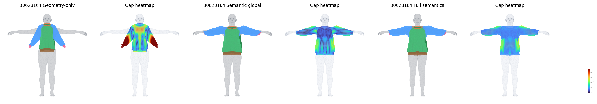
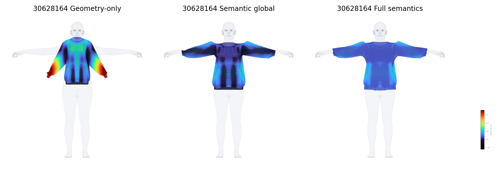

# Garment-to-body alignment

The ablation compares geometry-only alignment, global semantic guidance, and
the full fine-grained semantic representation. Gap heatmaps visualize the
garment-to-body surface distance.

The `tpose/` directory contains aligned garments in the canonical body pose for
the four garments used in the simulation showcase. The pants reference pose is
from the same garment's `09_09_01` motion setup; its rollout uses `10_10_03`.
