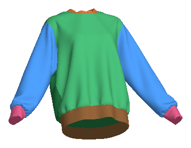
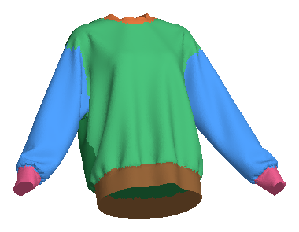
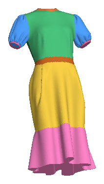
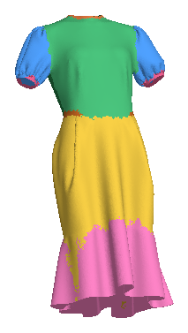
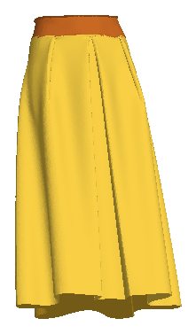
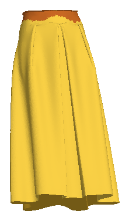
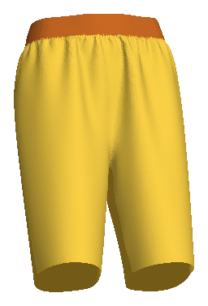
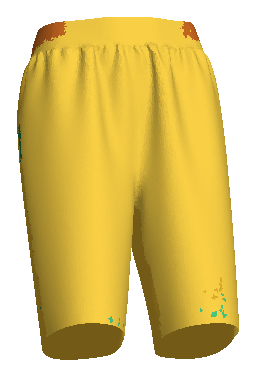

# Qualitative segmentation results

Each row compares the ground-truth labels, our topology-aware model, and the
semantic-only PT-v3m1 baseline on a held-out garment.

| Category | Ground truth | Ours | PT-v3m1 |
| --- | --- | --- | --- |
| Top |  |  |  |
| Dress |  |  |  |
| Skirt |  |  |  |
| Pants |  |  |  |

The `simulation_inputs/` subdirectory contains the semantic render associated
with each dynamic simulation example.
