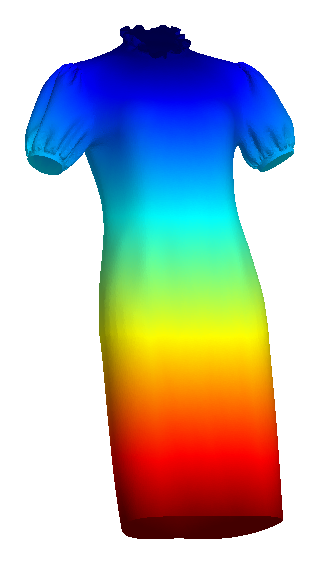
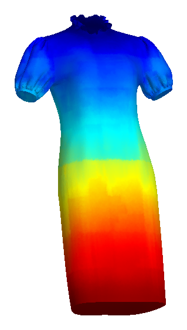
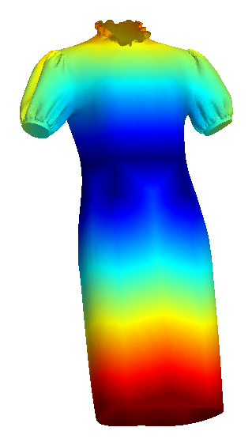
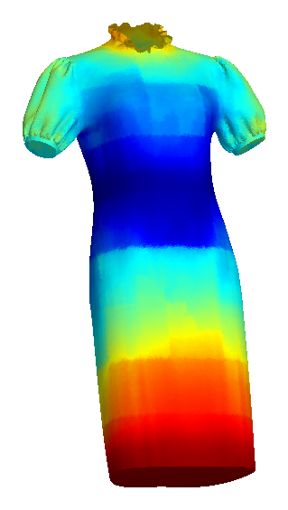
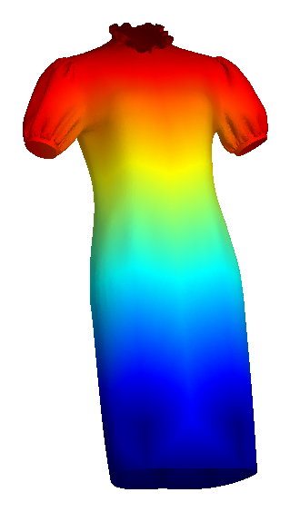
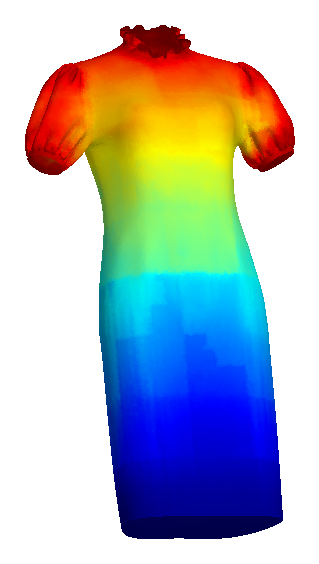
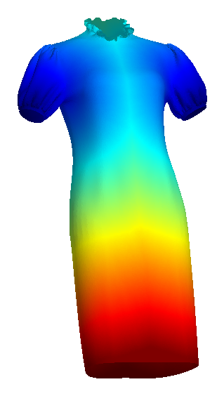
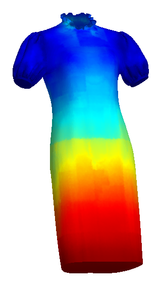

# Structural-field visualizations

The figures below show four normalized topology-aware fields on the held-out
dress `7ede5ae39a1a90c605de25aaabc83f5b`. Colors run from the anchor region
(blue) toward geodesically distant regions (red). Magenta denotes vertices for
which a field is not defined.

| Field | Ground truth | Prediction |
| --- | --- | --- |
| Neckline |  |  |
| Waistline |  |  |
| Hemline |  |  |
| Cuff (union) |  |  |
